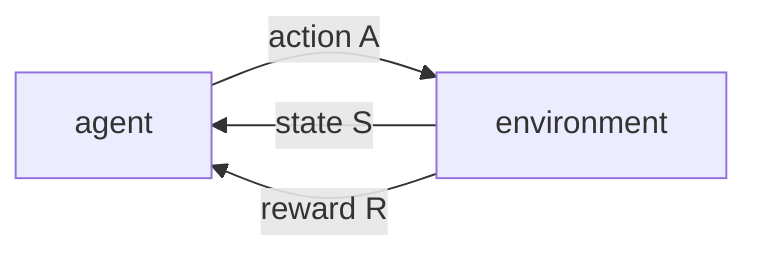
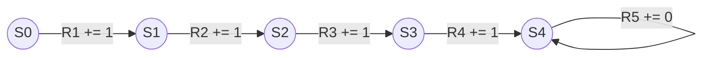

# Note for Reinforcement Learning: An Introduction
## Chapter One: Introduction
### **What is RL**
指的 一类问题和解决问题的方式，也是一种研究领域。
将状态映射到动作上，通过策略行动，来获得最大的回报。动作会影响奖励，需要通过尝试各种动作来决定行动(trail-and-error)。之前的动作会对之后的行为状态有所影响，~~完全没法子动态规划么(dynamic programming)！~~
### **Methods**
动力系统理论(Dynamical systems theory)  
马尔科夫决策过程(Markov decision processes)  

### **Supervised && Unsupervised && Reinforcement Learning**

#### *Three Learning paradigms(include philosophy and methods)*
#### 三种学习范式
#### **监督学习(Supervised Learning)**
需要标记数据，得到标签(label)，对标签做分类(classification)和回归(regression)问题，来解决不在训练集中的数据的回归，分类问题。
#### **无监督学习(Unsupervised Learning)**
寻找没有标签数据集合的结构
#### **强化学习(Reinforcement Learning)**
*feature*： 
交互(interacting)学习，权衡(trade-off)探索(exploration)和使用(exploitation)，使用、利用之前的经验，探索未知的状态，途中不断的失败，来获得最大收益(reward signal)。 
RL明确的考虑了目标导向(goal-directed)的与不确定环境的交互整个问题(什么意思没搞懂)，在面对子问题时，能够进行有效的规划，对解决某个子问题所产生的影响有所相应，即相互作用。 
强化学习采取一些tasks(怎么讲？任务？)，具有完整的，交互式的寻求目标(goal-seeking)的个体。拥有明确的目标，通过选择动作影响环境，通过权衡探索和利用环境达到决策目的，获得最大收益。能够和大环境，大系统交互(机器人，SC2，围棋etc)。 
~~能解决维数灾难？？？这可太列害了......很多dp问题都可以用RL解决了，太好力。~~

### **About "strong methods" and "weak methods"**
基于特定领域的知识；基于一般性原则

### **Elements of RL**
#### *四个主要的要素：法则或者策略(policy)，奖励(回报)信号(reward signal)，价值函数(value function)，环境模型(model of the enviorment)*
#### *策略法则*
状态到采取行动措施的过程映射，是一个随机过程。
#### *奖励信号*
给出RL的目标，在决策过程中，环境向个体发送奖励信号。智能体的目的是，通过各种决策，在最后，来让个体得到最大化奖励(即最优的)。奖励信号一种在短时间内就能得到的价值，短期利益。
#### *价值函数*
决定长期利益，即考虑遵循某些状态可获得的具有较高价值的长期奖励。由于每次抉择后都会给未来的状态产生一定的影响，如何考虑价值函数成为一个问题。
#### *环境模型*
智能体所在环境的仿真，用来预测下一个状态(环境是如何变化的)，为未来规划。

### **Limitations and Scope**
怎么定义状态，设计状态和行为

### **Tic-Tac-Toe**
感觉结合例子能够刚好的理解四个要素。 
通过编码确定(当前棋盘环境)游戏状态  
每个状态->胜率估计  
可以通过搜索树来搞吗  
如果用价值函数的RL方法来干的话尝试编码  

# Part I: Tabular Solution Methods
表格解决问题方法：状态和动作空间足够小（同时可以离散化表示？），这种问题通常能够找到最佳的价值函数和策略(policy)。
同时也存在着不能用表格解决的方法，比如：涉及维度爆炸或状态连续。

## Markov Decision Processes
马尔可夫决策过程以及解决其问题的三种方法：动态规划(Dynamic Programming)，蒙特卡罗方法(Monte Carlo)和时序差分(temporal-different)。

## Chapter 2 Multi-armed Bandits
多臂赌博机问题。 
强化学习与其他学习方式区别，或者RL的最重要的*特征*，在于其他学习给出了正确的指导（比如给出lable，给出正确的方向，答案），RL是同通过探索和利用（不断地尝试和试错 trial-and-error）来找出最优的答案。其中RL会对做出的动作进行评估，这种东西叫*评价性反馈*(Evaluative Feedback)。 
*关联性*(Nonassociative)讨论 
相比于能应用于实际上的RL，本章采用了一种更简单的场景：无需考虑每一步行动之间的影响，以及环境对行动的影响。

### 2.1 A K-armed Bandit Problem

#### **k臂老虎机问题背景**

* 你可以选择k种行动(action)中的一种
* 每种动作(action)都对应了一个数值奖励(nurmarical reward)，数值奖励是一个随机变量，符合某一种分布(distribution)，当然agent不知道这个分布。
* 目标是在一定时间内最大化奖励(奖励是一个累计值)。

#### **老虎机问题的数学表述：**

$$ q_*(a) \dot{=} \mathbb{E}[R_t|A_t = a] $$

* $q_*(a)$：是给定动作$a$选择的理论期望值，及对应分布的期望。
* $a$：一个任意的行动。
* $A_t$：是在时间步$t$选择的动作$A_t$。
* $R_t$：选择$A_t$相应的奖励为$R_t$。

在这个问题中，智能体并不知道每一个动作的回报分布，它通过不断地探索和利用来获得最优的评估体系。吧时间步$t$的动作$a$的估计值表示为$Q_t(a)$，我们希望$Q_t(a)\approx q_*(a)$此时出现了两种行为动作，分别是*贪婪*(greedy)和*探索*(exploration)。
*利用*贪婪行为利用了智能体对当前动作价值的了解，并非看重长远利益。
探索行为是选择非常规动作，即选择了一个在当前动作中回报并非那么大的。探索的意义在于找到更有价值的动作和信息。

### 2.2 Action-value Methods
动作价值方法是估算动作的价值，并使用这种估算结果来采取行动来选择策略。
#### **Sample-Average**
这是一种最为简单的方式，即平均奖励法：
$$Q_t(a) \dot{=} {\sum_{i=1}^{t-1}R_i \cdot \mathbb{1}_{A_i = a} \over \sum_{i=1}^{t-1} \mathbb{1}_{A_i = a}}$$
可以看出当样本足够多的时候，根据大数定律，$Q_t(a)$会收敛于$q_*(a)$。
#### **Greedy action**
贪婪动作为有最高估计价值的动作，数学表达为：
$$ A_t \dot{=} argmax_a Q_t(a) $$
可以预见的是，一直选择贪心策略的话，可以获得局部最优解，但是很难得到全局最优解。明显，此时可以通过一定的探索行为来换取长远的利益。

#### **$\epsilon$-greedy action**
即以 $1-\epsilon$ 的概率采取greedy action，以 $\epsilon$ 采取另一个行动 $a$。 
* 这个策略能够兼顾探索与利用。
* $\epsilon$ 的取值会影响收益，因此要给出一个合适的 $\epsilon$ 。

### 2.3 The 10-armed Testbed
本章来测试以上策略。

### 2.4 Incremental Implementation
增量问题实现，给出了一个增量形式的动作价值估计算法，基本的数学形式为：
$$ Q_n \dot{=} \frac{\sum_{i = 1}^{n - 1}{R_i}}{n-1} $$
* $R_i$：表示在第$i$次选择动作$a$之后的汇报
* $Q_n$：表示在前$n$次实行动作$a$的经验基础上，对下一次再选到$a$的预测值。

#### Optimization
对算法进行了优化，其数学表示可以变换为：
$$ Q_{n + 1} = Q_n + \frac{1}{n}[R_n - Q_n] $$
这个变换可以减少算法空间的复杂度，他的意义在于:
$$ NewEstimate \leftarrow OldEstimate + StepSize[Target - OldEstimate] $$

#### Pseuducode
在使用了$ \epsilon $-greedy和增量方法后，给出赌博机算法的伪代码：
> Initialize, for a = 1 to k:
$Q(a)\leftarrow 0 $ \
$N(a)\leftarrow 0 $ \
Loop forever:
$ A \leftarrow \left\{
\begin{aligned}
& argmax_aQ(a) & with \ probability \ 1-\epsilon \ (breaking \ ties \ randomly) \\
& \text  a \ random \ action & with \ probability \ \epsilon \\
\end{aligned}
\right. $
$ R \leftarrow bandit(A) $ \
$ N(A)\leftarrow N(A) + 1$ \
$ Q(A)\leftarrow Q(A) + \frac{1}{N(A)}[R-Q(A)]$

### **2.5 Tracking a Nonstationay Problem**
之前讨论的问题都是获得奖励的概率不会根据时间变化，即奖励的分布不会发生变化。实际情况一般来讲很难如此理想，本节讨论的是如何在不稳定的情况下解决赌博机问题，即tracking a nonstaionary problem。
在这种情况下常用方法是调整步长参数（step-size parameter），因为如果奖励值的分布出现了变动，当前智能体如果要推测变动的话，相比于观测更久远的时间点的奖励回报，在较近的时间点上入手能够跟好的体现价值。
新的数学形式如下：
$$Q_{n + 1} \dot{=} Q_n + \alpha[R_n - Q_n]  (\alpha \in (0, 1]) $$
其中 $ \alpha $ 就是步长参数，是一个常量，由此我们对上式进行变换（省略推导过程，懒得打那么多公式），整理得到：
$$ Q_{n + 1} \dot{=} (1-\alpha)^n Q_1 + \sum_{i = 1} ^ n (1-\alpha) ^ {n - i} \alpha R_i $$
可以看出两项参数 $(1-\alpha)^n +  \sum_{i = 1} ^ n (1-\alpha) ^ {n - i} \alpha = 1 $，这是一个加权平均式，所以被称为*指数新近加权平均值*(exponential recency-weighted average)。
可以看出，当$i \rightarrow \infty$时，$R_i$在式子中的影响占比才更大。
如果将$\alpha$看作一个序列${\alpha(n)}$，即我们可以逐步地改变步长参数，设定${\alpha_n(a)}$为处理完第$n$次动作选择后获取reward的步长参数，对这个序列有着这样的要求：
$$ (1) \sum_{n = 1} ^ {\infty} \alpha_n(a) = \infty$$
$$ (2) \sum_{n = 1} ^ {\infty} \alpha_n^2(a) < \infty$$
第一个条件是保证总体的步长参数足够长，以最终克服任何初始条件或随机波动。第二个条件保证最终的步长参数足够小以确保收敛。满足两个条件，$Q_n$将会向1收敛。当然。满足以上条件的步长参数序列一般会遇到收敛缓慢的问题，而不满足以上条件的条件的 $\alpha_n \equiv \alpha$ ，可以应用在提到的非稳定的问题中（也是在RL中一种常见的问题），所以是可取的。

### **2.6 Optimistic Initial Values**
通过之前的指数加权平均值算法可以看出，$Q_1$能够在一定程度上的影响评估体系，通过设定高初始值能够鼓励模型在早期更多的进行探索的应用，即*乐观初值法*。
但是本方法应用面较窄，仅适用于固定分布的问题。模型早期能够多进行exploration，后期进行exploitation，这是对于稳定情况的希望，而对于非稳定情况，就很难去讲了，可能在很多时刻都要进行exploration。（再改一下）

### **2.7 Upper-Confidence-Bound Action Selection**
UCB方法的数学表示如下：
$$ A_t \dot{=} argmax_a[Q_t(a) + c \sqrt{\frac{\ln t}{N_t(a)}}]$$
* $N_t(a)$ 表示在时间$t$之前选择动作$a$的次数。
* $c > 0$ 表示控制探索的程度，置信度。
* $c \sqrt{\frac{\ln t}{N_t(a)}}$ 是一个对估值的不确定性，通过改变这一项来决定未来的动作。

UCB方法能够找出有着最大潜力的行动，但是在处理非平稳问题以及大的状态空间的问题并不好。

### **2.8 Grandient Bandit Algorithms** 
梯度赌博机算法给出了一种有关于动作的偏好的算法，即动作的选择概率基于某一个分布的，在采取行动按照趋势而非数值大小进行选择，其数学表示为：
$$ Pr { A_t = a } \dot{=} \frac{e^{H_t(a)}}{\sum_{b = 1} ^ k e^{H_t(a)}} \dot{=} \pi_t(a) $$
* $H_t(a)$是动作$a$的偏好值。
* $\pi_t(a)$ 表示在时间$t$采取行动的概率。

同时取得每一步的反馈后，我们需要利用随机上升梯度法来更新偏好值：
$$H_{t+1}(A_t)\dot{=}H_t(A_t)+\alpha(R_t-\overline{R_t})(1-\pi_t(A_t))$$
$$H_{t+1}(a)\dot{=}H_t(a)-\alpha(R_t-\overline{R_t})\pi_t(a)$$
* 其中$\alpha > 0$ 为步长参数。
* $\overline{R_t} \in (R)$ 是所有奖励的平均值。
#### **Proof**
看书。
<!-- （再改一下） -->

### **2.9 Associative Search (Contextual Bandit)**
如何考虑关联性的任务，即每一步行动都会产生影响。
<!-- （再改一下） -->

## Chapter 3 : Finite Markov Decision Proccess
有限马尔可夫决策过程可以适用于，当当前选择的状态和动作对未来的决策和奖励有所影响的时候，如何估计动作的价值和状态价值，即解决一种序贯决策问题。
### **3.1 The Agent-Environment Interface**
个体环境接口给出了MDP中个体与环境之间的交互关系：

* agent为学习者智能体。
* environment为agent与外界交互实体的集合，即不能被agent任意改变的事物都是环境。
* 其中action &A& 为 $A_t$，表示在t时刻进行的动作A。
* State $S$为$S_t$是根据动作从环境中得到的下一个状态，反馈给智能体。
* Reward $R$为$R_t$是根据动作从环境中得到的下一个奖励，反馈给智能体。
* 从顺序上来讲，如果以时间$t$为起始点，以上的两项下标应该为$t + 1$。

这个图可以解释为agent和environment在某一个时间点$t$上进行交互，agent在状态$S \in S$处的基础上进行了行动$A_t \in A(s)$，之后agent会得到相应动作的数值奖励反馈$R_{t+1} \in R \subset \mathbb{R}$并且进入下一个状态$S_1$，同时不断地进行这个循环。此时MDP和agent产生了一个序列轨迹(trajectory):
$$ S_0, A_0, R_1, S_1, A_1, R_2, S_2, A_2,... $$
对于随机变量$R_t$和$S_t$都有着变心阿德离散概率分布，仅仅依赖于之前的动作和状态。对于未来的状态和反馈奖励在时间$t$发生的概率为：
$$ p(s^\prime, r|s, a) \dot{=} Pr \{S_t=s^\prime\, R_t=r|S_{t-1}=s, A_{t-1}=a\} $$
对于一个MDP问题，理解他的三个重要的要素状态、行动以及奖励是很重要的。
* action即agent的决策行动。
* state即agent的行动标准。
* rewards即agent的所有action的目标。

对于对于未来的状态和反馈奖励在时间$t$发生的概率公式中有着很多种变化。
<!-- （补上公式） -->

### **3.2 Goals and Rewards**
对于智能体来讲，奖励就是环境传递给个体的信号；而智能体或者说RL的目标就是最大化收到的总奖励的量，这是RL的一个显著特征。
对于一个智能体而言，外界提供的奖励能够使其达到想要的目标，这些都是智能体自己学习来的，而非一开始就告诉它哪个选项好，让它选择某一个。此时智能体有了探索环境的自由度，通过不断地探索环境和利用掌握的知识来达到目标。
### **3.3 Returns and Episodes**
数学形式定义最大化累计奖励要考虑智能体要最大化预期的奖励，此时可以定义为：
$$ G_t \dot{=} \sum^{T}_{i = t+1}R_i$$
其中T是最后的一个时间步，$G_t$就是定义的回报。
片段任务(episodes tasks)一般来讲指的是对不同的结果有不同的奖励，上一节的任务片段和下一节的任务片段没有联系。片段任务中，所有非终结状态的集合为$S$，终止时间$T$为随机变量，$S^+$为$S$和所有终止态。\
连续任务（continuous tasks）意为智能体和环境持续不断的交互产生的任务。此时的$T \rightarrow \infty$，无法得到$G_t$，所以要引入衰减因子（折扣因子？）。\
折扣因子（disconunted）$ \gamma $，当智能体选择动作$A_t$时得到的衰减回报为：
$$G_t \dot{=} \sum_{k=0}^{\infty}{\gamma^k}R_{t+k+1} \quad\quad 0 \leq \gamma \leq1$$

将上式变形为：
$$G_t \dot{=} R_{t+1} + \gamma G_{t+1}$$

可以看出，给定$\gamma$不同的值的时候，能够让智能体更有的短视或远见。
<!-- 写一下练习 -->
### **3.4 Unified Notation for Episodic and Continuing Tasks**
对于片段任务来讲，我们可以给出如下状态机，来保证与连续任务状态的统一形式，考虑一种吸收态，状态转移总会回到自己，同时奖励为0，可以表示为：

### **3.5 Policies and Value Functions**
策略和价值函数
### **3.6 Optimal Policies and Optimal Value Functions**
### **3.7 Optimality and Approximation**

